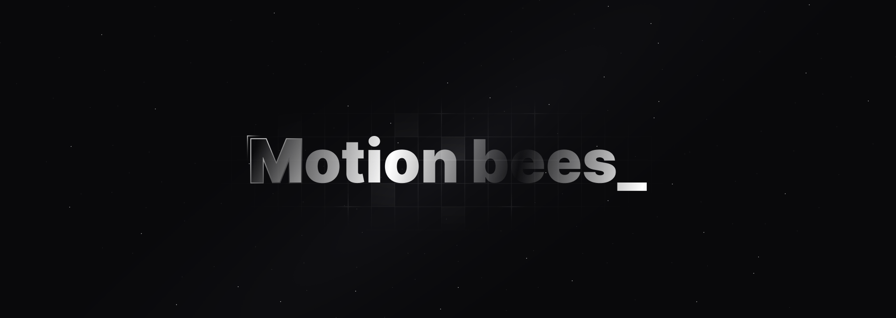

**Motion-bees**
Stylized and easily integrated, these motion components are designed for engineers and designers, using Framer Motion and Tailwind CSS.

This project is currently in beta. New components will be released on a regular basis and significant updates will be made to the code.

**Contributing**
I would love to have your help! If you want to contribute to Motion-Bees, you can do it easily. Make a fork of the repository using the following link and start working on your improvements and new ideas.

**Star this project on GitHub**
If you like this new button library with Framer Motion, give it a little star, that would be my payment.